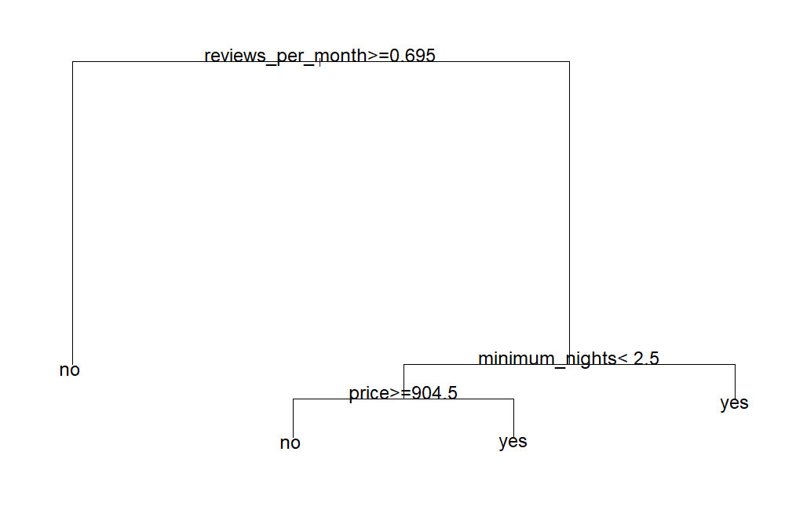

```{r libs, eval=TRUE, echo=FALSE}
#| message: false
#| warning: false

# install.packages(c("modelsummary", "fixest"))

#install.packages("GGally")
#install.packages("gtsummary")
#install.packages('stargazer')
#install.packages('patchwork')
#install.packages("glmnet")
#install.packages('lmridge')
#install.packages('MASS')
#install.packages("interactions")
#tinytex::tlmgr_install("tabularray")
#install.packages("car")

library(dplyr)
library(knitr)
library(plotly)
library(ggplot2)
library(ggpubr)
library(lubridate)
library(zoo)
library(tidyverse)
library(GGally)
library(modelsummary)
library(stargazer)
library(gtsummary)
library(patchwork)
library(glmnet)
library(lmridge)
library(tidyr)
library(caret)
library(dplyr)
library(interactions)
library(kableExtra)
library(patchwork) 
library(knitr)
library(broom)
library(car)
library(maps)
library(RColorBrewer)
library(tree)
library(sf)
library(rnaturalearth)
library(rnaturalearthdata)
library(ranger)
library(randomForest)
library(gbm)
library(Metrics)
library(lattice)
library(PRROC)
library(yardstick)
library(ROCR)
```

```{r, data_load, eval=T,echo=F}

listings_data=read.csv('listings.csv')
```

# Introduction: Exploratory Data Analysis

The training data consists of 10 rows of observations across 25 features. The data is significantly imbalanced in favour of the target class at with \~81% of observations in the filly_booked_30='no' class.

Some cleaning and transforming was done on the features to make them machine learning friendly, most notably:

-   Transformed all non-numerical features into factors
-   Transform the **host_since_int** variable which gives the date from which the host started hostig BnBs into an interger that calculates the host's "age" in months. The feature is saved as **host_since_months_int.**\

```{r, data_wrang, eval=T,echo=F}

listings_data_cleaned=listings_data %>% mutate(host_since=lubridate::ymd(host_since),
                         host_response_time=factor(host_response_time,levels=c("within an hour","within a few hours","within a day", "a few days or more")),
                         host_is_superhost=factor(host_is_superhost,levels=c('t','f')),
                         room_type=factor(room_type,levels=unique(listings_data$room_type)),
                         instant_bookable=factor(instant_bookable,level=c('t','f')),
                         fully_booked_30=factor(fully_booked_30, levels=c('yes','no')),
                         host_verifications=factor(case_when(host_verifications %in% c("['phone']") ~'phone_only',
                                                      host_verifications %in% c("['email', 'phone']" ,"['email', 'phone', 'work_email']", "['phone', 'work_email']") ~'phone_email',
                                                      host_verifications %in% c("['email']") ~'email_only'
                           
                         ),levels=c('phone_only','phone_email','email_only'))
                         
                         
                         )
```

```{r target_dist, eval=TRUE, echo=F}
#| message: false
#| warning: false
#| fig-height: 6
#| fig-subcap: Spatial Plot of BNB Listings,Fully Booked 30 Label Distribution
#| fig-width: 8
#| layout-ncol: 2


# Plot the Air BNB locations


cols <- ifelse(listings_data_cleaned$fully_booked_30 == 'no', "red", "blue")


plot(listings_data_cleaned$longitude,
      listings_data_cleaned$latitude,
     xlab = "Longitude",
     ylab = "Latitude",
       pch = 16,
       cex = 0.5,
       col = cols)

legend("topright",
       legend = c("Fully Booked", "Not Fully Booked"),
       col = c("blue", "red"),
       pch = 16,
       bty = "n",
       title = "Fully Booked 30",
       cex = 0.9)


listings_data_cleaned %>% 
  count(fully_booked_30) %>% 
  mutate(
    percentage = n / sum(n),
    label = paste0(round(percentage * 100, 1), "%")
  ) %>%
  ggplot(aes(x = fully_booked_30, y = n)) +
  geom_col(fill = 'steelblue') +
  geom_text(aes(label = label), 
            vjust = -0.5, size = 3) +
  labs(
    title = "Fully Booked vs Non Fully Booked",
    y = '#observations',
    x = "30-day booked status"
  ) +
  theme_minimal()
```

```{r host_since, eval=TRUE, echo=F}
#| message: false
#| warning: false
# re-engineer the host sinece feature to an interger in months
# keep date fixed to when this assignment satrted=May

fixed_month_str=ymd("2026-05-01")
fixed_month=floor_date(fixed_month_str,unit='month')

listings_data_cleaned$host_since_months_int =listings_data_cleaned %>% mutate(host_since=ymd(host_since)  ) %>% 
  mutate(host_since_trunc=floor_date(host_since,unit='month')) %>% 
  
  mutate(host_since_months_int= interval(host_since_trunc,fixed_month) %/% months(1) ) %>% 
  
  mutate(current_date= floor_date( today(),unit='month' ) ) %>% 
  
  dplyr::select(host_since_trunc,host_since_months_int,current_date ) %>%
  
  pull(host_since_months_int)

 # create intervals for EDA purposes
a=listings_data_cleaned %>% mutate(host_since_intervals=  cut(host_since_months_int, breaks=c(0,48,96,114,197),labels = c("0-2 yrs", "2-4 yrs", "4-6 yrs",'6+ yrs') )) %>% 
  group_by(host_since_intervals,fully_booked_30) %>% 
  summarize(n_cnt=length(host_id)) %>% 
ggplot(aes(x=fully_booked_30,y=n_cnt, fill=host_since_intervals))+
  geom_col(position="dodge")+
  labs(title = "Fully Booked vs Non Fully Booked Host Age",y='#observations',
       x = "30-day booked status",fill='host age bin')+
  theme_minimal()

a= listings_data_cleaned %>% ggplot(aes(x=price,fill=fully_booked_30)) +
  geom_boxplot()+
    labs(title = "Host Age By 30d Fully Booked Status",x='host age (months)',
       x = "30-day booked status",fill='30 booked status')+
  theme_minimal()


  


```

A simple decision tree to gauge which features could be important for determining the response variable. Since we have an imbalanced class, a weighted decision tree is used. The weights are a vector of ratios of the grouped observations counts of the different classes with the minority "yes" class. bieng weighted more. The ensure that the model is penalized more for misclassifying the minority class((<https://machinelearningmastery.com/cost-sensitive-decision-trees-for-imbalanced-classification/>))\

```{r, bar_plots,echo=F,eval=T}
#| message: false
#| warning: false
#| fig-height: 8
#| fig-width: 15

num_vars=listings_data_cleaned %>% group_by(fully_booked_30) %>% summarize(
  avg_host_response_rate=mean(host_response_rate),
  avg_host_acceptance_rate=mean(host_acceptance_rate),
  avg_host_listings_count=mean(host_listings_count),
  avg_price=mean(price),
  avg_minimum_nights=mean(minimum_nights),
  avg_review_scores_rating=mean(review_scores_rating)
)


vars <- c(
  "host_response_rate",
  "host_acceptance_rate",
  "host_listings_count",
  "price",
  "minimum_nights",
  "review_scores_rating"
)


# Initialize empty list
plot_list <- list()

# Loop through variables
for (var in vars) {
  
  # Create summary dataframe dynamically
  df_plot <- listings_data_cleaned %>%
    group_by(fully_booked_30) %>%
    summarise(mean_value = mean(.data[[var]], na.rm = TRUE))
  
  # Create plot
  p <- ggplot(df_plot, aes(x = fully_booked_30, y = mean_value)) +
    geom_col(fill = "steelblue") +
    labs(
      title = paste("Average", gsub("_", " ", var), "by Booking Status"),
      x = "30-day booked status",
      y = paste("Average", gsub("_", " ", var))
    ) +
    theme_minimal()
  
  # Store in list
  plot_list[[var]] <- p
}

# View one example

vars <- c(
  "host_response_rate",
  "host_acceptance_rate",
  "host_listings_count",
  "price",
  "minimum_nights",
  "review_scores_rating"
)

(plot_list[["price"]]+plot_list[["minimum_nights"]]+plot_list[["review_scores_rating"]])/ (plot_list[["host_acceptance_rate"]]+plot_list[["host_response_rate"]]+plot_list[["host_listings_count"]])+(a)
```

When grouping by the target variable, fully_booked_30, the following key insights are observed:

-   Average Price and average minimum nights are slightly higher for observations in the "yes" class, with the gap much wider foraverage minimum nights (\~ 50 % higher than the "no" class).
-   Average review scores and average response rate are fairly evenly split across the two target classes
-   Average host listings are higher for the "no" class with an average of \~20 listings.
-   For the host age, the median (118 months) host age is \~5% higher for the "yes" class compared to the no class. Moreover no class has a longer range of host ages, although the distributions abot the median for both groups are similar; most host ages lie below the median host age.

```{r,w_vec,eval=T,echo=FALSE}


cnt_no_obs=listings_data_cleaned %>% filter(fully_booked_30=='no') %>% count()
cnt_yes_obs=listings_data_cleaned %>% filter(fully_booked_30=='yes') %>% count()
class_ratio=cnt_no_obs/cnt_yes_obs

weights_vector=ifelse(listings_data_cleaned$fully_booked_30=='no',class_ratio,1)

weights_vector=unlist(weights_vector)


listings_data_cleaned$fully_booked_30[1:5];
```

A simple decision tree is ran to see how the nodes and targets are split in relation to the features

```{r get_feat, eval=T, echo=F}
#| message: false
#| warning: false

# Can't use vanilla decision tree as the data data is extremly unbalanced :()
# Thus we have to assign weights to the binary classes, as a proxy for importance
# We put more weight to the rare class, in this case fully_booked_30=yes

# ratio= #obs=1:#obs=yes 
library(rpart)
# cnt_no_obs=listings_data_cleaned %>% filter(fully_booked_30=='no') %>% count()
# cnt_yes_obs=listings_data_cleaned %>% filter(fully_booked_30=='yes') %>% count()
# class_ratio=cnt_no_obs/cnt_yes_obs

# weights_vector=ifelse(listings_data_cleaned$fully_booked_30=='yes',class_ratio,1)
# 
# weights_vector=unlist(weights_vector)

features_all=names(listings_data_cleaned)
features=features_all[! features_all %in% c('host_since','host_id', 'fully_booked_30_lab')]

listings_data_cleaned_features=listings_data_cleaned %>% dplyr::select(any_of(features))

eda_tree <-  rpart(fully_booked_30 ~ ., data = listings_data_cleaned_features,weights=weights_vector)


```

{width="410"}

Features used to reduce RSS during splitting were **reviews_per_month (the largest reduction), minimum_nr_night,** and **price.**\
BnB listings with reviews_per_month greater than 0.695 all had terminal nodes categorised as "no" for the response variable. Price and minimum nights were determining factors for listings with a minimum number of nights less than 2.5, which ended in "yes". Further splitting this region, for listings where the minimum was greater than 2.5, listings with prices greater than 905.5 were also categorised as "yes".

```{r scatter_plot, eval=F, echo=FALSE}
#| message: false
#| warning: false
#| fig-height: 8
#| fig-width: 8
split_feats=c('reviews_per_month','minimum_nights','price')


listings_data_cleaned %>% dplyr::select(reviews_per_month,minimum_nights,price,fully_booked_30) %>% 
ggpairs( 1:4,mapping = aes(color = fully_booked_30), legend = 1 ) +
  labs(title = "Decision Tree Used Feature Pairwise Plot",color='30d Fully Booked')+
  theme_minimal()+
  theme(legend.position = "bottom") #setdiff(split_feats, "fully_booked_30")

```

# Model Training

```{r,logloss,eval=T,echo=F}
log_loss=function(data,lev = NULL, model = NULL){
  
  ytrue <- ytrue <- ifelse(data$obs == "no", 1, 0) # actuals, turn back to "numbers"
  
  # Force probability to numeric
  yhat <- as.numeric(as.character(data$no))# predicted probabilities for positive class
  
  c(LogLoss = logLoss(ytrue, yhat)) # return logloss at each kfold iteration
}


# secondary log_loss function for vanilla model

log_loss_van=function(ytrue,yhat){

  
  c(LogLoss = logLoss(ytrue, yhat))}

```

**Baseline Model Vanilla Logistic Regression**

```{r model_log, eval=T, echo=F}
#| message: false
#| warning: false

library(broom) 
library(boot)
log_mod <- glm(fully_booked_30 ~ ., data = listings_data_cleaned_features, family = binomial)

# log_mod |> 
#   tidy() |>
#   kable(digits = 2) |> 
#   kable_styling(full_width = FALSE)


bl_sum=tbl_regression(log_mod,
                       intercept = TRUE) %>%
  add_significance_stars() %>%
  add_glance_source_note(
    include = c(nobs) #r.squared, adj.r.squared,
  ) %>%
  modify_caption("**Baseline Model: Logistic Regression, All Features**")

bl_sum
# exp(coef(log_mod)) |>
#   kbl(format = 'pdf',
#       digits = 3, 
#       col.names = c('<i>X</i><sub>j</sub>', 'exp(&beta;<sub>j</sub>)'),
#       escape = FALSE) |>
#   kable_styling(full_width = FALSE)

```

-   Significant Features:

    -   The number of reviews per month has the highest and significant effect on the probability of the target variable, a unit increase in the number of reviews per month increases the likelihood of an Air BnB not bieng fully booked by \~95% (Calculation e\*\*beta, where beta=0.67).

    -   Latitude and Longitude- location places a significant role BnB demand and the likelihood of a BnB being fully booked- although the signs for both features are different

    -   Although features host_acceptance_rate is significant, host_since_months_int and host_acceptance_rate are significant they does not seem to have an extremly negligeble effect on the likelihood of the positive class( target='no').

    -   Host Listings Count

    -   Review Score Ratings

    -   Instant bookable=F,

    -   Host Since (Measured in months)

-   Insignificant Features:

    -   The rest\* comeback

    -   Most interestingly the price!-\

    ```{r}


    ```

**L1 Regularization**

```{r regul, eval=T, echo=F}
#| message: false
#| warning: false


exp(0.67)-1

library(plotmo) #Specifically for glmnet plotting (also has a gbm function)

features_train=features[features!='fully_booked_30'] 
x_train_df =listings_data_cleaned_features %>% dplyr::select(any_of(features_train))
y_train=listings_data_cleaned_features$fully_booked_30


x_train <- model.matrix(
  as.formula(paste("~", paste(setdiff(names(x_train_df), 'fully_booked_30'), collapse = "+"))),
  data =x_train_df 
)[, -1]

# Create folds for the data to keep track of CV ID
# createFolds internally stratifies the sample to ensure propotions are representative for each fold

folds = createFolds(y_train, k = 10) 
foldid = rep(NA, length(y_train))
for(i in seq_along(folds)){
  foldid[folds[[i]]] <- i
}


# Fit the lasso and plot using plotmo
# Add weights paramenter to "rebalance " the data, rare misclassification of rare class is penalized more
# Add foldid argument to keep track of CV folds for metrics later on
logmod_l1 <-cv.glmnet (x_train, y_train, alpha = 1, standardize = T, family = 'binomial',type.measure="auc",keep=T,foldid = foldid)
plot(logmod_l1) #


```

From the above, the best number of non-zero coefficients equals 9 (using 1SE discrimination). This is used to identify the zero-coefficient features.

```{r}
```

```{r,zero_coeff,echo=FALSE,eval=T}
#coef(logmod_l1, s = 2.5)
#logmod_l1$df

# penalized coeff, lambda=lambda.1se
best_coeff=as.data.frame(as.matrix(coef(logmod_l1, s = "lambda.1se") )) %>% rownames_to_column(var = "Feature") %>% rename(Coefficient=lambda.1se)


best_coeff %>%
  kable(
    format = "latex",
    booktabs = TRUE
  ) %>%
  row_spec(
    which(best_coeff$Coefficient == 0),
    color = "red"
  ) %>%
  kable_styling(latex_options = "hold_position")


```

Penalized Features:\

-   response ratwe

-   acceptance rate

-   is_superhost

-   host ver

-   lat and long

-   all those in red

**Random Forest**

Using all non_zero_coeff

```{r}

#Weights for the outcome classes (in order of the factor levels) # in the splitting rule

class_ratio=class_ratio %>% pull(n)
class.weights = c(class_ratio, 1) # no=1, yes=0
class.weights
```

```{r,rd,echo=F,eval=TRUE}
library(caret)
library(doParallel)
library(foreach)


rf_grid = expand.grid(mtry = 2:(ncol(listings_data_cleaned_features) - 1), 
                             splitrule = c('gini','hellinger'), # imbalanced data   
                             min.node.size = c(1,5,10))


ctrl = trainControl(method = 'cv',number = 10, verboseIter = F,savePredictions ="final", classProbs = TRUE)

# n_cores <- parallel::detectCores() - 1  # leave one core free
# cl <- makeCluster(n_cores)
# clusterEvalQ(cl, library(caret))
# registerDoParallel(cl)
# #clusterExport(cl, varlist = c("log_loss"))
# 
# rf_gridsearch <- train(fully_booked_30 ~ .,
#                              data = listings_data_cleaned_features,
#                              method = 'ranger',
#                              num.trees = 250,
#                              importance = 'impurity',
#                              trControl = ctrl,
#                              tuneGrid = rf_grid,
#                              class.weights=class.weights
# 
# )
# # 
# stopCluster(cl)
# registerDoSEQ()


#write.csv(rf_gridsearch$results, "caret_rf_grid_results_cv_weights.csv")
#saveRDS(rf_gridsearch, file = "caret_rf_grid_results_cv_weights.rds")


#write.csv(rf_gridsearch$results, "caret_rf_grid_results_cv_weights.csv")
#saveRDS(rf_gridsearch, file = "caret_rf_grid_results_cv_weights.rds")


# 

rf_gridsearch =readRDS("caret_rf_grid_results_cv_weights.rds")
```

```{r}


```

```{r,rd_res,echo=F,eval=T}
results_df=data.frame(rf_gridsearch$results)
best_param=rf_gridsearch$bestTune


best_oob_accuracy=results_df %>% filter(Accuracy==max(Accuracy)) %>% pull(Accuracy)

best_oob_mtry=results_df %>% filter(Accuracy==max(Accuracy)) %>% pull(mtry)

best_oob_min_node=results_df %>% filter(Accuracy==max(Accuracy)) %>% pull(min.node.size)
  
plot(
  rf_gridsearch,
  xlim = range(rf_gridsearch$results$mtry) + c(-1, 0.5),
  ylim = range(rf_gridsearch$results$Accuracy) + c(-0.001, 0.00),
  panel = function(x, y, ...) {
    panel.xyplot(x, y, ...)
    panel.abline(h = best_oob_accuracy, col = "red", lwd = 1,lty = 2)
    panel.text(
      x = best_oob_mtry,
      y = best_oob_accuracy,
      labels = paste(
        "best mtry:", best_oob_mtry,
        "\nbest min node:", best_oob_min_node
      ),
      pos = 3,
      cex = 0.7   
    )
  }
)
```

```{r,best_rf_hp,echo=F,eval=TRUE}
kable(rf_gridsearch$bestTune,caption='Best RF HyperParameters')
# remember we want the combination that yields the highest OOB accuracy


```

**Boosting Model**

Used non-zero features from the regularized model to speed up training- we've established that the majority of these are not relevant anyway through CV and the

Used features:

```{r,non_zero_coeff,echo=F,eval=F}
non_zero_feats=best_coeff %>% filter(Coefficient!=0) %>% pull(Feature)
non_zero_feats

```

```{r,gbm_fit,eval=T,echo=F}
library(doParallel)
library(foreach)
set.seed(123)
library

# ctrl = trainControl(method = 'cv', number = 10, verboseIter = F,                            classProbs = TRUE,summaryFunction =log_loss,savePredictions ="final")
# 
# gbm_feats=listings_data_cleaned_features %>% select(any_of( c(non_zero_feats,'fully_booked_30') ) )


# gbm_grid <- expand.grid(n.trees = c(1000,2500,3000),
#                               interaction.depth = seq(1, 10, 2),
#                               shrinkage =c(0.01,0.02,0.04),
#                               n.minobsinnode = 10)
# 
# CV for hyper parameter tuning
# n_cores <- parallel::detectCores() - 1  # leave one core free
# cl <- makeCluster(n_cores)
# clusterEvalQ(cl, library(Metrics))
# registerDoParallel(cl)
# clusterExport(cl, varlist = c("log_loss"))
# 
# gbm_gridsearch <- train(fully_booked_30 ~ .,data =gbm_feats,
#                               method = 'gbm',
#                               distribution = "bernoulli", #
#                               trControl = ctrl,
#                               verbose = T,
#                               tuneGrid = gbm_grid,
#                               metric = "LogLoss",
#                               weights=weights_vector)
# 
# stopCluster(cl)
# registerDoSEQ()
# 
# save(gbm_gridsearch , file = 'gbm_gridsearch.Rdata')

# load('gbm_gridsearch_2.Rdata')

load('gbm_gridsearch.Rdata')
#rf_gridsearch =readRDS("caret_rf_grid_results_cv_weights.rds")

```

```{r, gbm_load,eval=F,echo=F}
#gbm_gridsearch=gbm_all_gridsearch
gbm_gridsearch$results %>% 
  mutate(
    interaction.depth = factor(interaction.depth),
    shrinkage = factor(shrinkage)
  ) %>% 
  group_by(interaction.depth, n.trees, shrinkage) %>% 
  summarize(LogLoss = mean(LogLoss), .groups = "drop") %>% 
  
  ggplot(aes(x = n.trees,
             y = LogLoss,
             color = interaction.depth,
             group = interaction.depth)) +
  
  geom_line() +
  geom_point() +
  
  facet_wrap(~shrinkage,
             labeller = labeller( shrinkage = function(x) paste("shrinkage:", x))
             ) +
  
  labs(
    title = "CV K-fold Log Loss vs Hyperparameters",
    x = "# Boosting Iterations",
    y = "CV Log Loss",
    color = "Max Tree Depth"
  ) +
  
  theme_minimal() +
  
  theme(
    strip.text = element_text(size = 11),
    legend.position = "top"
  )
```

```{r gbm_hp_sel, eval=F, echo=T}
#| message: false
#| warning: false
plot(gbm_gridsearch)
```

The best parameter is acquired at the hyperparameter combinations below:\

```{r, best_com, eval=TRUE,echo=FALSE}
kable(gbm_gridsearch$bestTune %>% dplyr::select(n.trees,interaction.depth,shrinkage) %>% 
        rename(`nr trees`=n.trees,`interaction depth`=interaction.depth)
        , caption = 'GBM Best HyperParameter Combination')
```

```{r}
load('gbm_gridsearch.Rdata')

sel_feat=names(gbm_gridsearch$trainingData)
train_sel_feat=sel_feat[sel_feat!='.outcome']
```

```{r,gbm_all,eval=TRUE,echo=TRUE}
# using all features comparability

library(doParallel)
library(foreach)
set.seed(123)

# ctrl = trainControl(method = 'cv', number = 10, verboseIter = F,                            classProbs = TRUE,summaryFunction =log_loss)

ctrl = trainControl(method = 'cv', number = 10, verboseIter = F,                            classProbs = TRUE,summaryFunction =log_loss,savePredictions ="final")


gbm_grid <- expand.grid(n.trees = c(500,1000,1500),
                              interaction.depth = seq(1, 5, 1),
                              shrinkage =c(0.005, 0.01),
                              n.minobsinnode = 10)

#CV for hyper parameter tuning
# n_cores <- parallel::detectCores() - 1  # leave one core free
# cl <- makeCluster(n_cores)
# clusterEvalQ(cl, library(Metrics))
# registerDoParallel(cl)
# clusterExport(cl, varlist = c("log_loss"))
# 
# gbm_all_gridsearch <- train(fully_booked_30 ~ .,data =listings_data_cleaned_features,
#                               method = 'gbm',
#                               distribution = "bernoulli", #
#                               trControl = ctrl,
#                               verbose = T,
#                               tuneGrid = gbm_grid,
#                               metric = "LogLoss",
#                               weights=weights_vector)
# 
# stopCluster(cl)
# registerDoSEQ()


#save(gbm_all_gridsearch , file = 'gbm_all_gridsearch.Rdata')

saveRDS(rf_gridsearch, file = "caret_rf_grid_results_cv_weights.rds")

#saveRDS(rf_gridsearch, file = "caret_rf_grid_results_cv_weights.rds")


#load('gbm_all_gridsearch.Rdata')
```

```{r,eval=T,echo=F}
plot(gbm_gridsearch )
```

```{r,gbm_all_best,echo=TRUE,eval=TRUE}
kable(gbm_gridsearch$bestTune %>% dplyr:: select(n.trees,interaction.depth,shrinkage) %>% 
        rename(`nr trees`=n.trees,`interaction depth`=interaction.depth)
        , caption = 'GBM Best HyperParameter Combination')
```

# Question 3- Model Evaluation and Selection

a\)

```{r,tau,echo=FALSE,eval=T}
tau= listings_data_cleaned_features %>% count(fully_booked_30) %>% mutate(
,prop=n/sum(n)
) %>% filter(fully_booked_30=='no') %>% pull(prop);tau

```

```{r,metrics_fuc,eval=T,echo=F}
#library(ditto)
library(ROCR)
library(PRROC)
library(yardstick)

my_metrics <- function(df, pred, labs, tau = tau) {
  
  # Ensure numeric 0/1
  labs <- as.numeric(labs)-1#as.numeric(as.character(labs))
  
  # Build evaluation data
  df_eval <- data.frame(
    truth = factor(labs, levels = c(0, 1)),
    estimate = factor(ifelse(pred >= tau, 1, 0), levels = c(0, 1)),
    .pred_1 = pred
  )
  
  # Classification metrics
  acc  <- yardstick::accuracy(df_eval, truth, estimate)$.estimate
  rec  <- yardstick::recall(df_eval, truth, estimate)$.estimate
  sp   <- yardstick::spec(df_eval, truth, estimate)$.estimate
  prec <- yardstick::precision(df_eval, truth, estimate)$.estimate
  f1   <- yardstick::f_meas(df_eval, truth, estimate)$.estimate
  
  # Probabilistic metrics
  rocauc <- roc_auc(df_eval, truth, .pred_1)$.estimate
  prauc  <- pr_auc(df_eval, truth, .pred_1)$.estimate
  log_loss_ <- mn_log_loss(df_eval, truth, .pred_1)$.estimate
  
  # Return named vector
  metrics <- c(
    "Log Loss"   = log_loss_,
    "AUPRC"      = prauc,
    "Recall"     = rec,
    "Specificity"= sp,
    "Precision"  = prec,
    "F1"         = f1,
    "Accuracy"   = acc,
    "ROC AUC"    = rocauc
  )
  
  return(metrics)
}


# Get predictions and metrics across all CV validation folds


evaluate_on_validations <- function(val_list, model, target_col, tau = tau) {
  
  all_metrics <- lapply(val_list, function(df) {
    
    # Extract labels
    labs <- df[[target_col]] # fully_booked_30 
    
    # Build feature matrix (exclude target)
   # new_x <- as.matrix(df[, setdiff(names(df), target_col)])
    
    new_x <- model.matrix(
    as.formula(paste("~", paste(setdiff(names(df), 'fully_booked_30'), collapse = "+"))),
   data =df
  )[, -1]
    
    # Get predicted probabilities
    pred <- predict(
      model,
      newx = new_x,
      s = "lambda.1se",
      type = "response"
    )[, 1]
    
    # Compute metrics
    m <- my_metrics(df, pred, labs, tau)
    
    return(m)
  })
  
  # Combine results
  metrics_matrix <- do.call(rbind, all_metrics)
  
  # Average across validation sets
  mean_metrics <- colMeans(metrics_matrix, na.rm = TRUE)
  
  return(mean_metrics)
}

```

```{r,cv_l1_log_pred,echo=F,eval=T}

# CV metrics for L1 logistic regression

log_l1_val_list=vector(mode='list',length=10) # list containing validation indicies
for (k in  1:10){
  # get indicies that equal the validation fold in question
  obs_id=which(logmod_l1$foldid==k) 
  log_l1_val_list[[k]]=obs_id
  
  
  
}


# Get validation data sets


n <- 10 # nr K folds
log_val_data_sets <- vector("list", n)

for (i in 1:n){

  val_data=listings_data_cleaned_features[log_l1_val_list[[i]],] # get the actual observations from the fold ids

  val_data=listings_data_cleaned_features[log_l1_val_list[[i]],] # get the actual observations from the fold ids

  log_val_data_sets[[i]]=val_data
  
}


log_l1_logloss_scores=c()
log_l1_prauc_scores=c()
log_l1_acc_scores=c()
log_l1_rec_scores=c()
log_l1_sp_scores=c()
log_l1_prec_scores=c()
log_l1_f1_scores=c()

n=10 # folds

for(k in 1:n){

labs <- log_val_data_sets[[k]][["fully_booked_30"]]
df=log_val_data_sets[[k]]
new_x <- model.matrix(
    as.formula(paste("~", paste(setdiff(names(df), 'fully_booked_30'), collapse = "+"))),
   data =df
  )[, -1]


pred <- predict(
      logmod_l1,
      newx = new_x,
      s = "lambda.1se",
      type = "response"
    )[, 1]

labs <- ifelse(labs=='no',1,0) #as.numeric(labs)-1


df_eval <- data.frame(
    truth = factor(labs, levels = c(0, 1)),
    estimate = factor(ifelse(pred >= tau, 1, 0), levels = c(0, 1)),
    .pred_1 = pred
  )

 
 log_loss_ <- mn_log_loss(df_eval, truth, .pred_1,event_level = 'second')$.estimate

 prauc= pr_auc(df_eval, truth, .pred_1)$.estimate

 prauc= pr_auc(df_eval, truth, .pred_1,event_level='second')$.estimate # use second level as this is the event,positive class

 rec  <- yardstick::recall(df_eval, truth, estimate)$.estimate
 sp   <- yardstick::spec(df_eval, truth, estimate)$.estimate
 prec <- yardstick::precision(df_eval, truth, estimate)$.estimate
 f1   <- yardstick::f_meas(df_eval, truth, estimate)$.estimate
 acc  <- yardstick::accuracy(df_eval, truth, estimate)$.estimate
 
log_l1_logloss_scores=c(log_l1_logloss_scores,log_loss_)
log_l1_prauc_scores=c(log_l1_prauc_scores, prauc)
log_l1_rec_scores=c(log_l1_rec_scores,rec)
log_l1_sp_scores=c(log_l1_sp_scores,sp )
log_l1_prec_scores=c(log_l1_prec_scores,prec)
log_l1_f1_scores=c(log_l1_f1_scores, f1)
log_l1_acc_scores=c(log_l1_acc_scores, acc)
 
 }


cv_log_l1_results=data.frame(list(model='L1 Logistic_regression', 
     Log.loss=mean(log_l1_logloss_scores,na.rm=T),
     AUPRC=mean(log_l1_prauc_scores,na.rm=T),
     Recall=mean(log_l1_rec_scores,na.rm=T),
     Specificity=mean(log_l1_sp_scores,na.rm=T),
     Precision=mean(log_l1_prec_scores,na.rm=T),
     F1=mean(log_l1_f1_scores,na.rm=T),
     Accuracy=mean(log_l1_acc_scores,na.rm=T)
     ))
 
  

 
 cv_log_l1_results
 
```

```{r,cv_rf_pred,echo=F,eval=T}

# CV metrics for rf
# Get fold indicies
x_train=listings_data_cleaned_features %>% dplyr::select(any_of(features_train))

train_indices =rf_gridsearch$control$index
all_indices <- seq_len(nrow(x_train))


rf_validation_indices <- lapply(train_indices, function(train_idx) {
  setdiff(all_indices, train_idx)
})


# Get validation data sets


n <- 10 # nr K folds
rf_val_data_sets <- vector("list", n)

for (i in 1:n){
  val_data=listings_data_cleaned_features[rf_validation_indices[[i]],] # get the actual observations from the fold ids
  rf_val_data_sets[[i]]=val_data
  
}


# Get CV val predictions

rf_logloss_scores=c()
rf_prauc_scores=c()
rf_acc_scores=c()
rf_rec_scores=c()
rf_sp_scores=c()
rf_prec_scores=c()
rf_f1_scores=c()

n=10 # folds

for(k in 1:n){

labels <- rf_val_data_sets[[1]][["fully_booked_30"]]
df=rf_val_data_sets[[1]]


new_data=df %>% dplyr::select(any_of(features_train))

pred=predict(rf_gridsearch,newdata=
new_data,type = "prob")[,'no']

labs <- if_else(labels=='no',1,0)


df_eval <- data.frame(
    truth = factor(labs, levels = c(0, 1)),
    labels=labels,
    estimate = factor(ifelse(pred >= tau, 1, 0), levels = c(0, 1)),
    .pred_1 = pred
  )


 
 log_loss_ = mn_log_loss(df_eval, truth, .pred_1,event_level = 'second')$.estimate
 acc  = yardstick::accuracy(df_eval, truth, estimate)$.estimate
 prauc= pr_auc(df_eval, truth, .pred_1,event_level = 'second')$.estimate
 rec  = yardstick::recall(df_eval, truth, estimate)$.estimate
 sp   = yardstick::spec(df_eval, truth, estimate)$.estimate
 prec = yardstick::precision(df_eval, truth, estimate)$.estimate
 f1   = yardstick::f_meas(df_eval, truth, estimate)$.estimate
 
rf_logloss_scores=c(rf_logloss_scores,log_loss_)
rf_prauc_scores=c(rf_prauc_scores, prauc)
rf_acc_scores=c(rf_acc_scores, acc)
rf_rec_scores=c(rf_rec_scores,rec)
rf_sp_scores=c(rf_sp_scores,sp )
rf_prec_scores=c(rf_prec_scores,prec)
rf_f1_scores=c(rf_f1_scores, f1)
 
 }


cv_rf_results=data.frame(list(model='Random Forest', 
     Log.loss=mean(rf_logloss_scores,na.rm=T),
     AUPRC=mean(rf_prauc_scores,na.rm=T),
     Recall=mean(rf_rec_scores,na.rm=T),
     Specificity=mean(rf_sp_scores,na.rm=T),
     Precision=mean(rf_prec_scores,na.rm=T),
     F1=mean(rf_f1_scores,na.rm=T),
     Accuracy=mean(rf_acc_scores,na.rm=T)
     ))
 
  


```

```{r}
train_sel_feat=names(gbm_gridsearch$trainingData)[2:length(names(gbm_gridsearch$trainingData))]

```

```{r gbm_cv_all,echo=F,eval=T}

# Get predictions
#train_sel_feat
#features_train
#train_sel_feat

# x_train=listings_data_cleaned_features %>% select(any_of(features_train))
# 
# train_indices =gbm_all_gridsearch$control$index

  
x_train=listings_data_cleaned_features %>% dplyr::select(any_of(train_sel_feat))

train_indices =gbm_gridsearch$control$index

#x_train=listings_data_cleaned_features %>% select(any_of(features_train))


all_indices <- seq_len(nrow(x_train))


gbm_validation_indices <- lapply(train_indices, function(train_idx) {
  setdiff(all_indices, train_idx)
})


n <- 10 # nr K folds
gbm_val_data_sets <- vector("list", n)

for (i in 1:n){
  val_data=listings_data_cleaned_features[gbm_validation_indices [[i]],] # get the actual observations from the fold ids
  gbm_val_data_sets[[i]]=val_data
  
}


gbm_logloss_scores=c()
gbm_prauc_scores=c()
gbm_acc_scores=c()
gbm_rec_scores=c()
gbm_sp_scores=c()
gbm_prec_scores=c()
gbm_f1_scores=c()

# prediction vectors


n=10 # folds

gbm_val_data_predictions_sets <- vector("list", n)
true_label_list=vector("list", n)

for(k in 1:n){

labs <-gbm_val_data_sets[[1]][["fully_booked_30"]]
df=gbm_val_data_sets[[1]]


# new_data=df %>% select(any_of(train_sel_feat))#
# 
# pred=predict(gbm_all_gridsearch,newdata= #gbm_all_gridsearch
# new_data,type = "prob")[,'no']


new_data=df %>% dplyr::select(any_of(train_sel_feat))#
#new_data=df %>% select(any_of(features_train))


#pred=predict(gbm_gridsearch,newdata=new_data)#
#gbm_all_gridsearch

pred=predict(gbm_gridsearch,newdata=new_data,type = "prob")[,'no']


gbm_val_data_predictions_sets[[k]]=pred # save the predictiond for each validation fold

labs <-ifelse(labs == "no",1,0) # encode the labels
true_label_list[[k]]=labs # store the true labels for each fold


df_eval <- data.frame(
    truth = factor(labs, levels = c(0, 1)),
    estimate = factor(ifelse(pred >= tau, 1, 0), levels = c(0, 1)),
    .pred_1 = pred
  )

 
 log_loss_ = mn_log_loss(df_eval, truth, .pred_1,event_level = 'second')$.estimate

 prauc= pr_auc(df_eval, truth, .pred_1)$.estimate


 prauc= pr_auc(df_eval, truth, .pred_1,event_level = 'second')$.estimate

 acc= yardstick::accuracy(df_eval, truth, estimate)$.estimate
 rec  = yardstick::recall(df_eval, truth, estimate)$.estimate
 sp  = yardstick::spec(df_eval, truth, estimate)$.estimate
 prec = yardstick::precision(df_eval, truth, estimate)$.estimate
 f1   = yardstick::f_meas(df_eval, truth, estimate)$.estimate
 
gbm_logloss_scores=c(gbm_logloss_scores,log_loss_)
gbm_prauc_scores=c( gbm_prauc_scores, prauc)
gbm_acc_scores=c(gbm_acc_scores, acc)
gbm_rec_scores=c(gbm_rec_scores,rec)
gbm_sp_scores=c(gbm_sp_scores,sp )
gbm_prec_scores=c(gbm_prec_scores,prec)
gbm_f1_scores=c(gbm_f1_scores, f1)
 
 }


cv_gbm_results=data.frame(list(model='GBM XG Boost', 
     Log.loss=mean(gbm_logloss_scores,na.rm=T),
     AUPRC=mean(gbm_prauc_scores,na.rm=T),
     Recall=mean(gbm_rec_scores,na.rm=T),
     Specificity=mean(gbm_sp_scores,na.rm=T),
     Precision=mean(gbm_prec_scores,na.rm=T),
     F1=mean(gbm_f1_scores,na.rm=T),
     Accuracy=mean(gbm_acc_scores,na.rm=T)
     ))
 
  

cv_gbm_results


```

```{r}
#| fig-height: 8
#| fig-width: 8
# concat results
 library(patchwork)
all_metrics=rbind(cv_log_l1_results,cv_rf_results,cv_gbm_results)


# plot all metrics

met_rics=names(all_metrics)[2:length(all_metrics)]

fig_loss=ggplot(all_metrics, aes(x= model ,y=Log.loss)) +
  geom_col(fill='steelblue')+
  labs(title='CV Log Loss Per Model ',x=' ')+
  theme_minimal()+
    theme(axis.text.x = element_text(angle = 45, vjust = 0.9, hjust = 1))
  
fig_auprc=ggplot(all_metrics, aes(x= model ,y=AUPRC)) +
  geom_col(fill='steelblue')+
  labs(title='CV AUPRC Per Model ',x=' ')+
  theme_minimal()+
    theme(axis.text.x = element_text(angle = 45, vjust =  0.9,, hjust = 1))


fig_recall=ggplot(all_metrics, aes(x= model ,y=Recall)) +
  geom_col(fill='steelblue')+
  labs(title='CV Recall Per Model ',x=' ')+
  theme_minimal()+
  theme(axis.text.x = element_text(angle = 45, vjust =  0.9,, hjust = 1))

fig_spec=ggplot(all_metrics, aes(x= model ,y=Specificity)) +
  geom_col(fill='steelblue')+
  labs(title='CV Specificity Per Model ',x=' ')+
  theme_minimal()+
    theme(axis.text.x = element_text(angle = 45, vjust =  0.9,, hjust = 1))
  


fig_prec=ggplot(all_metrics, aes(x= model ,y=Precision)) +
  geom_col(fill='steelblue')+
  labs(title='CV Prec Per Model ',x=' ')+
  theme_minimal()+
    theme(axis.text.x = element_text(angle = 45, vjust =  0.9,, hjust = 1))

fig_f1=ggplot(all_metrics, aes(x= model ,y=F1)) +
  geom_col(fill='steelblue')+
  labs(title='CV F1 Per Model ',x=' ')+
  theme_minimal()+
  theme(axis.text.x = element_text(angle = 45, vjust =  0.9,, hjust = 1))

fig_acc=ggplot(all_metrics, aes(x= model ,y=Accuracy)) +
  geom_col(fill='steelblue')+
  labs(title='CV Accuracy Per Model', x=' ')+
  theme_minimal()+
  theme(axis.text.x = element_text(angle = 45, vjust =  0.9,, hjust = 1))


(fig_loss+fig_auprc+fig_recall)/(fig_spec+fig_prec+fig_f1)+(fig_acc)

```

**Boosting tree** is the best model, given all the metrics:\

-   Lowest penalty of negative predictions from log loss- primary metric

-   Best AUPRC- best metric for imbalanced data set

```{r,gmb_roc, eval=T, echo=F}
#| message: false
#| warning: false
library(ROCR)
library(pROC)
library(AUC)


result <- function(x) {
  ifelse(x < tau, 0, 1)
}

#x= probabilities of the bieng in the positive class
# x<tau label=0
#x>tau label=1
predictions=gbm_val_data_predictions_sets #CV validation predictions
predictions_labels=lapply(predictions, result)
labels=true_label_list # true labels
pred = prediction(predictions, labels)


threshold <- tau

sensitivity_list <- sapply(seq_along(labels), function(i) {
  truth <- factor(labels[[i]], levels = c(0, 1))
  pred <- factor(ifelse(predictions[[i]] >= threshold, 1, 0), levels = c(0, 1))
  
  sens(data.frame(truth, pred), truth = truth, estimate = pred)$.estimate
})

specificity_list <- sapply(seq_along(labels), function(i) {
  truth <- factor(labels[[i]], levels = c(0, 1))
  pred <- factor(ifelse(predictions[[i]] >= threshold, 1, 0), levels = c(0, 1))
  
  spec(data.frame(truth, pred), truth = truth, estimate = pred)$.estimate
})


CV_tprs=mean(sensitivity_list) # mean across val folds
CV_fprs=mean(1-specificity_list)# mean across val folds
CV_tprs;CV_fprs


perf = performance(pred, "tpr", "fpr")
plot(perf, col="grey82", lty=3,lwd=4,main=' Boosted Tree 10 Fold CV ROC')
plot(perf, avg="vertical", lwd=3, col="blue", add=TRUE)
points(CV_fprs,CV_tprs, col = 'red', pch = 16)
abline(a = 0, b = 1, col = "grey60", lty = 2, lwd = 2)
text(CV_fprs,CV_tprs-0.1, labels =  bquote(tau == .(threshold)), pos = 4, col = "black",offset = 0.5)


```

# Section 4- Interpretation

```{r}
library(vip)
# Best Model= GBM

```

```{r,feat_imp,echo=F,eval=T}
# Answer rest of q3


var_imp_gmb=varImp(gbm_gridsearch)
var_imp_gmb$Feature=row.names(var_imp_gmb)


gini_imp=var_imp_gmb%>% 
  ggplot(aes(x=Feature,y=Overall))+
  geom_col(fill='steelblue')+
  labs(title='GBM Impurity Variable Importance', x='Feature',y='Relative Importance (%)')+theme_minimal()


x_train=listings_data_cleaned_features %>% dplyr::select(any_of(train_sel_feat))

pred_wrapper=function(object,newdata){
  predict(object,newdata=newdata,type = "prob")[,'no'] # prediction probabilities for AUC
  
}

vi <- vi_permute(
  object = gbm_gridsearch,
  feature_names = colnames(x_train),
  train = x_train,
  target = listings_data_cleaned_features$fully_booked_30,
  metric = 'roc_auc',#"Accuracy",   # or "AUC", "RMSE"
  pred_wrapper  = pred_wrapper,
  nsim = 5,
  event_level = "second"
  
)


```

```{r,feat_imp_plot,echo=FALSE,eval=T}
p_feature_impo=vi %>% ggplot(aes(y= reorder(Variable, Importance),x=Importance)) +
  geom_col(fill='steelblue')+
  labs(title='Permutation Variable Importance', x='Importance',y='Featutre')+theme_minimal()
  
p_feature_impo/ gini_imp
```

```{r,pdp,echo=F,eval=F}
library(pdp)
# Partial plots
# Use most important features
best_trees=gbm_gridsearch$bestTune$n.trees

top_4=vi %>% arrange(desc(Importance)) %>% head(4) %>% pull(Variable)

n_cores <- parallel::detectCores() - 1  # leave one core free
cl <- makeCluster(n_cores)
clusterEvalQ(cl, library(caret))
registerDoParallel(cl)
# #clusterExport(cl, varlist = c("log_loss"))

pdp_data_v1=partial(gbm_gridsearch, pred.var =top_4[1],prob=T , parallel = TRUE)
pdp_data_v2=partial(gbm_gridsearch, pred.var =top_4[2],prob=T , parallel = TRUE)# parallel)
pdp_data_v3=partial(gbm_gridsearch, pred.var =top_4[3],prob=T  ,parallel = TRUE)# Enable parallel)
pdp_data_v4=partial(gbm_gridsearch, pred.var =top_4[4],prob=T  ,parallel = TRUE) # Enable parallel)

stopCluster(cl)
registerDoSEQ()

```

```{r pdp_plots, eval=T,echo=F}
#| message: false
#| warning: false
#| fig-height: 6
#| fig-width: 10
#| fig-cap: "Partial Dependence Plots for Top 4 Features"


 # saveRDS(pdp_data_v1,file='pdp_data_v1.rds')
 # saveRDS(pdp_data_v2,file='pdp_data_v2.rds')
 #  saveRDS(pdp_data_v3,file='pdp_data_v3.rds')
 #   saveRDS(pdp_data_v4,file='pdp_data_v4.rds')

pdp_data_v1 <- readRDS("pdp_data_v1.rds")
pdp_data_v2 <- readRDS("pdp_data_v2.rds")
pdp_data_v3 <- readRDS("pdp_data_v3.rds")
pdp_data_v4 <- readRDS("pdp_data_v4.rds")

p1=pdp_data_v1 %>% ggplot(aes(x=reviews_per_month,y=yhat))+
  geom_line()+
  labs(title='ReviewS Per Month vs Predicted Probabilities', x=' Reviews Per Month', y='predicted prob(Y=no)')+
  theme_minimal()

p2=pdp_data_v2 %>% ggplot(aes(x=host_since_months_int,y=yhat))+
  geom_line()+
  labs(title='Host Age vs Predicted Probabilities', x='Host Age (months)', y='predicted prob(Y=no)')+
  theme_minimal()

p3=pdp_data_v3 %>% ggplot(aes(x=minimum_nights_avg_ntm,y=yhat))+
  geom_line()+
  labs(title='Avg Minimum Nights vs Predicted Probabilities', x='Average Min Nights', y='predicted prob(Y=no)')+
  theme_minimal()

p4=pdp_data_v4 %>% ggplot(aes(x=review_scores_rating,y=yhat))+
  geom_line()+
  labs(title='Review Scores Rating vs Predicted Probabilities', x='Review Scores Rating', y='predicted prob(Y=no)')+
  theme_minimal()

(p1+p2)/(p3+p4)

```

```{r,test,eval=F,echo=F}

library(forcats)

test=read_csv('testing.csv')
test

# Engineer features
test_cleaned=test %>% mutate(host_since=lubridate::ymd(host_since),
                         host_response_time=factor(host_response_time,levels=c("within an hour","within a few hours","within a day", "a few days or more")),
                         host_is_superhost=factor(host_is_superhost,levels=c('t','f')),
                         room_type=factor(room_type,levels=unique(test$room_type)),
                         instant_bookable=factor(instant_bookable,level=c('TRUE','FALSE')),
                         host_verifications=factor(case_when(host_verifications %in% c("['phone']") ~'phone_only',
                                                      host_verifications %in% c("['email', 'phone']" ,"['email', 'phone', 'work_email']", "['phone', 'work_email']") ~'phone_email',
                                                      host_verifications %in% c("['email']") ~'email_only'
                           
                         ),levels=c('phone_only','phone_email','email_only'))
                         
                         
                         )


test_cleaned$host_since_months_int =test_cleaned %>% mutate(host_since=ymd(host_since)  ) %>% 
  mutate(host_since_trunc=floor_date(host_since,unit='month')) %>% 
  mutate(host_since_months_int= interval(host_since_trunc,floor_date(today(),unit='month'))%/% months(1) ) %>% mutate(current_date= floor_date( today(),unit='month' ) ) %>% 
  dplyr::select(host_since_trunc,host_since_months_int,current_date ) %>% pull(host_since_months_int)


test_cleaned  <- test_cleaned  %>%
  mutate(instant_bookable = fct_recode( instant_bookable, 
                             "t" = "TRUE", 
                             "f" = "FALSE"))

# Using selected feature model
test_sel=test_cleaned %>% dplyr::select(any_of(train_sel_feat))
test_pred_probs=predict(gbm_gridsearch,newdata=test_sel,type = "prob")[,'no']

# get test predictions
test_pred_probs_df=data.frame(test_pred_probs)

write.table(test_pred_probs_df, 
            file = "AFFPAM001.csv", 
            sep = ",", 
            col.names = FALSE, 
            row.names = FALSE)

```
