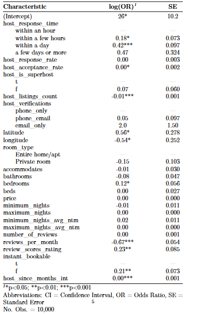

```{r libs, eval=TRUE, echo=FALSE}
#| message: false
#| warning: false

# install.packages(c("modelsummary", "fixest"))

#install.packages("GGally")
#install.packages("gtsummary")
#install.packages('stargazer')
#install.packages('patchwork')
#install.packages("glmnet")
#install.packages('lmridge')
#install.packages('MASS')
#install.packages("interactions")
#tinytex::tlmgr_install("tabularray")
#install.packages("car")

library(dplyr)
library(knitr)
#library(skimr)
library(plotly)
library(ggplot2)
library(ggpubr)
library(lubridate)
library(zoo)
library(tidyverse)
library(GGally)
library(modelsummary)
library(stargazer)
library(gtsummary)
library(patchwork)
library(glmnet)
library(lmridge)
library(tidyr)
library(caret)
#library(MASS)
library(dplyr)
library(interactions)
library(kableExtra)
library(patchwork) 
library(knitr)
library(broom)
library(car)
library(maps)
library(RColorBrewer)
library(tree)
library(sf)
library(rnaturalearth)
library(rnaturalearthdata)
library(ranger)
library(randomForest)
library(gbm)
```

You can add options to executable code like this

```{r, data_load, eval=T,echo=F}

listings_data=read.csv('listings.csv')


```

# Data Wrangling

```{r, data_wrang, eval=T,echo=F}

listings_data_cleaned=listings_data %>% mutate(host_since=lubridate::ymd(host_since),
                         host_response_time=factor(host_response_time,levels=c("within an hour","within a few hours","within a day", "a few days or more")),
                         host_is_superhost=factor(host_is_superhost,levels=c('t','f')),
                         room_type=factor(room_type,levels=unique(listings_data$room_type)),
                         instant_bookable=factor(instant_bookable,level=c('t','f')),
                         fully_booked_30=factor(fully_booked_30,levels=c('yes','no')),
                         host_verifications=factor(case_when(host_verifications %in% c("['phone']") ~'phone_only',
                                                      host_verifications %in% c("['email', 'phone']" ,"['email', 'phone', 'work_email']", "['phone', 'work_email']") ~'phone_email',
                                                      host_verifications %in% c("['email']") ~'email_only'
                           
                         ),levels=c('phone_only','phone_email','email_only'))
                         
                         
                         )
```

```{r,eda,eval=T,echo=F}

# Plot the Air BNB locations


# cities_poly <- ne_download(scale = 'large', type = 'urban_areas', category = 'cultural')

#names(cities_poly)

za_admin2 <- ne_states(country = "South Africa", returnclass = "sf")
cape_town <- za_admin2[grep("Western Cape", za_admin2$name), ]

#View(za_admin2 %>% filter(name=='Western Cape'))

cols <- ifelse(listings_data_cleaned$fully_booked_30 == 1, "red", "blue")

# plot(st_geometry(cape_town ),
#      col = NA,
#      border = "black",
#      lwd = 2,
#      xlab = "Longitude",
#      ylab = "Latitude")

plot(listings_data_cleaned$longitude,
      listings_data_cleaned$latitude,
     xlab = "Longitude",
     ylab = "Latitude",
       pch = 16,
       cex = 0.5,
       col = cols)

legend("topright",
       legend = c("Not Fully Booked", "Fully Booked"),
       col = c("blue", "red"),
       pch = 16,
       bty = "n",
       title = "Fully Booked 30",
       cex = 0.9)
```

# EDA and Feature Selection

```{r eval=TRUE, echo=F}
#| message: false
#| warning: false
# used stratified smapling for training
listings_data_cleaned %>% group_by(fully_booked_30) %>% summarize(n_cnt=length(host_id)) %>% ggplot(aes(x=fully_booked_30,y=n_cnt
))+
  geom_col(fill='steelblue')+
  labs(title = "Fully Booked vs Non Fully Booked",y='#observations',
       x = "30-day booked status")+
  theme_minimal()
```

```{r host_since, eval=TRUE, echo=F}
#| message: false
#| warning: false
# re-engineer the host sinece feature to an interger in months
# keep date fixed to when this assignment satrted=May
listings_data_cleaned$host_since_months_int =listings_data_cleaned %>% mutate(host_since=ymd(host_since)  ) %>% 
  mutate(host_since_trunc=floor_date(host_since,unit='month')) %>% 
  mutate(host_since_months_int= interval(host_since_trunc,floor_date(today(),unit='month'))%/% months(1) ) %>% mutate(current_date= floor_date( today(),unit='month' ) ) %>% 
  dplyr::select(host_since_trunc,host_since_months_int,current_date ) %>% pull(host_since_months_int)

 # create intervals for EDA purposes
listings_data_cleaned %>% mutate(host_since_intervals=  cut(host_since_months_int, breaks=c(0,48,96,114,197),labels = c("0-2 yrs", "2-4 yrs", "4-6 yrs",'6+ yrs') )) %>% 
  group_by(host_since_intervals,fully_booked_30) %>% 
  summarize(n_cnt=length(host_id)) %>% 
ggplot(aes(x=fully_booked_30,y=n_cnt, fill=host_since_intervals))+
  geom_col(position="dodge")+
  labs(title = "Fully Booked vs Non Fully Booked",y='#observations',
       x = "30-day booked status")+
  theme_minimal()
  


```

Use a novel decision tree to gauge which features could be important for determining the response variable. Since we have an imbalanced class, a weighted decision tree is used:\
<https://machinelearningmastery.com/cost-sensitive-decision-trees-for-imbalanced-classification/>\

```{r get_feat, eval=T, echo=F}
#| message: false
#| warning: false

# Can't use vanilla decision tree as the data data is extremly unbalanced :()
# Thus we have to assign weights to the binary classes, as a proxy for importance
# We put more weight to the rare class, in this case fully_booked_30=yes

# ratio= #obs=1:#obs=yes 
library(rpart)
cnt_no_obs=listings_data_cleaned %>% filter(fully_booked_30=='no') %>% count()
cnt_yes_obs=listings_data_cleaned %>% filter(fully_booked_30=='yes') %>% count()
class_ratio=cnt_no_obs/cnt_yes_obs

weights_vector=ifelse(listings_data_cleaned$fully_booked_30=='yes',class_ratio,1)

weights_vector=unlist(weights_vector)

features_all=names(listings_data_cleaned)
features=features_all[! features_all %in% c('host_since','host_id')]

listings_data_cleaned_features=listings_data_cleaned %>% dplyr::select(any_of(features))

eda_tree <-  rpart(fully_booked_30 ~ ., data = listings_data_cleaned_features,weights=weights_vector)


```

{width="410"}

Features used to reduce RSS during splitting were **reviews_per_month (the largest reduction), minimum_night,** and **price.**\
BnB listings with reviews_per_month greater than 0.695 all had terminal nodes with the categorisation "no" for the response variable. Price and minimum nights were determining factors for listings with a minimum number of nights less than 2.5, which ended in "yes". Further splitting this region, for listings where the minimum was greater than 2.5, listings with prices greater than 905.5 were also categorised as "yes".

```{r scatter_plot, eval=T, echo=FALSE}
#| message: false
#| warning: false
#| fig-height: 8
#| fig-width: 8
split_feats=c('reviews_per_month','minimum_nights','price')


listings_data_cleaned %>% dplyr::select(reviews_per_month,minimum_nights,price,fully_booked_30) %>% 
ggpairs( 1:4,mapping = aes(color = fully_booked_30), legend = 1 ) +
  labs(title = "Decision Tree Used Feature Pairwise Plot",color='30d Fully Booked')+
  theme_minimal()+
  theme(legend.position = "bottom") #setdiff(split_feats, "fully_booked_30")

```

-   comeback and add more

# Model Training

**Baseline Model Vanilla Logistic Regression**

```{r model_log, eval=T, echo=F}
#| message: false
#| warning: false

library(broom) #For nice tables
log_mod <- glm(fully_booked_30 ~ ., data = listings_data_cleaned_features, family = binomial)

# log_mod |> 
#   tidy() |>
#   kable(digits = 2) |> 
#   kable_styling(full_width = FALSE)


bl_summ=tbl_regression(log_mod,
                       intercept = TRUE) %>%
  add_significance_stars() %>%
  add_glance_source_note(
    include = c(nobs) #r.squared, adj.r.squared, 
  ) %>%
  # modify_source_note(
  #   source_note = f_text
  #) %>%
  modify_caption("**Baseline Model: Logistic Regression, All Features**")

# exp(coef(log_mod)) |>
#   kbl(format = 'pdf',
#       digits = 3, 
#       col.names = c('<i>X</i><sub>j</sub>', 'exp(&beta;<sub>j</sub>)'),
#       escape = FALSE) |>
#   kable_styling(full_width = FALSE)

```

-   

    {width="473" height="555"}

-   Significant Features:

    -   Intercept ( which absorbes the omitted categorical variables: within a few hours, instant bookable=T)

    -   Latitude and Longitude,

    -   Bedrooms,

    -   Reviews per month

    -   Review Score Ratings

    -   Instant bookable=F,

    -   Host Since (Measured in months)

-   Insignificant Features:

    -   The rest\* comeback

    -   Most interestingly the price!-\

```{r, regul, echo=F,eval=T}

library(plotmo) #Specifically for glmnet plotting (also has a gbm function)

features_train=features[features!='fully_booked_30']
x_train =data.matrix(listings_data_cleaned_features %>% dplyr::select(any_of(features_train)))
y_train=listings_data_cleaned_features$fully_booked_30

# Fit the lasso and plot using plotmo
# I think it looks wiered due to the imbalanced nature of the data
logmod_l1 <-cv.glmnet (x_train, y_train, alpha = 1, standardize = T, family = 'binomial',weights=weights_vector)
plot(logmod_l1)#, xvar = 'norm')


```

From the above, the best number of non-zero coefficients equals 9 (using 1SE discrimination). This is used to identify the zero-coefficient features.

```{r,zero_coeff,echo=FALSE,eval=T}
#coef(logmod_l1, s = 2.5)
#logmod_l1$df

# penalized coeff, lambda=lambda.1se
best_coeff=as.data.frame(as.matrix(coef(logmod_l1, s = "lambda.1se") )) %>% rownames_to_column(var = "Feature") %>% rename(Coefficient=lambda.1se)


best_coeff %>%
  kable(
    format = "latex",
    booktabs = TRUE
  ) %>%
  row_spec(
    which(best_coeff$Coefficient == 0),
    color = "red"
  ) %>%
  kable_styling(latex_options = "hold_position")


```

Penalized Features:\

-   response ratwe

-   acceptance rate

-   is_superhost

-   host ver

-   lat and long

-   all those in red

```{r,rd,echo=F,eval=TRUE}
library(caret)

#CV for mtry,min_node size
# rf=randomForest(fully_booked_30 ~ ., data = listings_data_cleaned_features,weights=weights_vector,importance=T)

rf_grid = expand.grid(mtry = 2:(ncol(listings_data_cleaned_features) - 1), # no. of features to randomly select for each tree
                             splitrule = 'gini', #classification      
                             min.node.size = seq(1,20,5) )# controls the smallest number of training samples required for a node to be eligeble for a split


ctrl = trainControl(method = 'oob', verboseIter = F)   


# rf_gridsearch <- train(fully_booked_30 ~ ., 
#                              data = listings_data_cleaned_features,
#                              method = 'ranger', # for random forest
#                              num.trees = 250, # should this be included in the gridsearch?
#                              importance = 'impurity',
#                              #verbose = T,
#                              trControl = ctrl,
#                              tuneGrid = rf_grid,
#                               weights=weights_vector) #to cater for an imbalanced dataset


#write.csv(rf_gridsearch$results, "caret_rf_grid_results.csv")
#saveRDS(rf_gridsearch, file = "rf_gridsearch.rds")


rf_gridsearch =readRDS("rf_gridsearch.rds")
```

```{r,rd_res,echo=F,eval=T}
results_df=data.frame(rf_gridsearch$results)
best_param=rf_gridsearch$bestTune

# results_df %>% group_by(min.node.size,mtry) %>% summarize(Accuracy=mean(Accuracy)) %>% 
#   ggplot(aes(x=min.node.size,y=Accuracy,color=mtry))+
#   geom_line()+
#   geom_point()+
#   facet_wrap(~mtry)+
#   labs(title = "Grid Search Results",y='weighted accuracy',
#        x = "min node size",color='#randomized tree features')+
#   theme_minimal()
# 
best_oob_accuracy=results_df %>% filter(Accuracy==max(Accuracy)) %>% pull(Accuracy)

best_oob_mtry=results_df %>% filter(Accuracy==max(Accuracy)) %>% pull(mtry)

best_oob_min_node=results_df %>% filter(Accuracy==max(Accuracy)) %>% pull(min.node.size)
  


library(lattice)

plot(
  rf_gridsearch,
  xlim = range(rf_gridsearch$results$mtry) + c(-1, 0.5),
  ylim = range(rf_gridsearch$results$Accuracy) + c(-0.01, 0.0028),
  panel = function(x, y, ...) {
    panel.xyplot(x, y, ...)
    panel.abline(h = best_oob_accuracy, col = "red", lwd = 1,lty = 2)
    panel.text(
      x = best_oob_mtry,
      y = best_oob_accuracy,
      labels = paste(
        "best mtry:", best_oob_mtry,
        "\nbest min node:", best_oob_min_node
      ),
      pos = 3,
      cex = 0.7   
    )
  }
)
```

```{r}
print(rf_gridsearch$bestTune) # remember we want the combination that yields the highest OOB accuracy

results_df %>% filter(Accuracy==max(Accuracy)) %>% pull(Accuracy)
```

**Boosting Model**

Used non-zero features from the regularised model to speed up traning- we've established that the majority of these are not relevant anyway through CV

Used features:

```{r,echo=F,eval=F}

library(Metrics)

non_zero_feats=best_coeff %>% filter(Coefficient!=0) %>% pull(Feature)

log_loss=function(data,lev = NULL, model = NULL){
  
  ytrue <- as.numeric(data$obs) # actuals
  
  # Force probability to numeric
  yhat <- as.numeric(as.character(data$no))# predicted probabilities for positive class
  
  c(LogLoss = logLoss(ytrue, yhat)) # return logloss at each kfold iteration
}
```

```{r,gbm_fit,eval=F,echo=F}

# Use Cv

# ctrl <- trainControl(method = 'cv', number = 10, verboseIter = T)
# 
# gbm_feats=listings_data_cleaned_features %>% select(any_of( c(non_zero_feats,'fully_booked_30') ) )
# 
# gbm_lib <- gbm(full_booked_30 ~ .,data =gbm_feats, 
#                distribution =  "bernoulli", #Applies squared error loss 
#                n.trees = 1000, # Needs CV
#                interaction.depth = 1, #$ Need CV
#                shrinkage = 0.01, # Needs Cv
#                bag.fraction = 1,
#                weights_vector)   # to cater for the extreme data imbalance
# 
# yhat_gbm <- gbm_lib$fit
# (mse_gbm <- mean((y - yhat_gbm)^2))
```

```{r}
gbm_feats %>% filter(is.na(fully_booked_30))

#log_loss(c(1,0,0),c(0.6,0.1,0.7))

actual <- c(1, 1, 1, 0, 0, 0) #as.numeric(data$obs == "no") as.numeric(as.character(data$no))
predicted <- c(0.9, 0.8, 0.4, 0.5, 0.3, 0.2)

data=list(obs=actual,no=predicted)
log_loss(data)

#unique(gbm_feats$fully_booked_30)
```

```{r,gbm_fit,eval=F,echo=F}
library(doParallel)
library(foreach)
set.seed(123)

ctrl = trainControl(method = 'cv', number = 10, verboseIter = F,                            classProbs = TRUE,summaryFunction =log_loss)

gbm_feats=listings_data_cleaned_features %>% select(any_of( c(non_zero_feats,'fully_booked_30') ) )


gbm_grid <- expand.grid(n.trees = c(1000,3000,5000),
                              interaction.depth = seq(1, 10, 2),
                              shrinkage =seq(0.01,0.10,0.03),
                              n.minobsinnode = 10)

n_cores <- parallel::detectCores() - 1  # leave one core free
cl <- makeCluster(n_cores)
clusterEvalQ(cl, library(Metrics))
registerDoParallel(cl)
clusterExport(cl, varlist = c("log_loss"))

gbm_gridsearch <- train(fully_booked_30 ~ .,data =gbm_feats,
                              method = 'gbm',
                              distribution = "bernoulli", # 
                              trControl = ctrl,
                              verbose = T,
                              tuneGrid = gbm_grid,
                              metric = "LogLoss",
                              weights=weights_vector)

stopCluster(cl)
registerDoSEQ()

save(gbm_gridsearch , file = 'gbm_gridsearch.Rdata')
```
